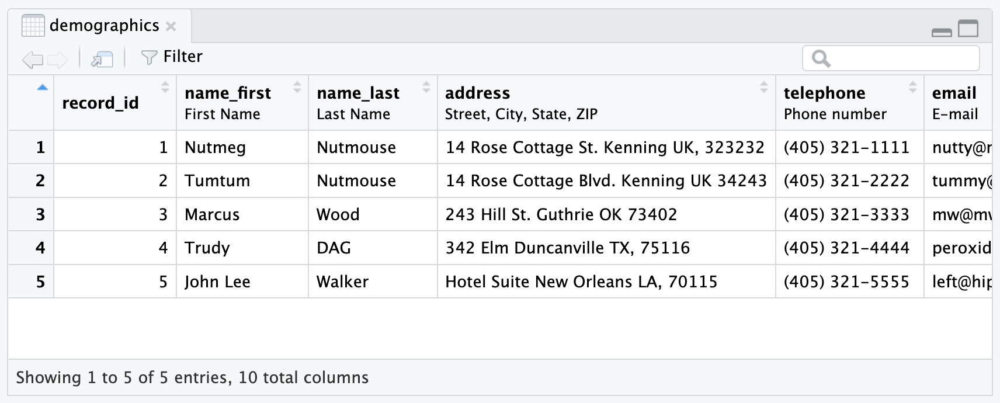

```{r, include = FALSE}
knitr::opts_chunk$set(
  collapse = TRUE,
  comment = "#>"
)
```

```{r setup}
library(tidyREDCap)
```

# The Problem

The `tidyREDCap` package creates data sets with labelled columns. 

```{r eval=FALSE}
tidyREDCap::import_instruments(
  url = "https://bbmc.ouhsc.edu/redcap/api/",
  token = keyring::key_get("REDCapR_test")
)
```

```{r hidden-data-load, echo=FALSE}
demographics <- structure(
  list(
    record_id = c(1, 2, 3, 4, 5),
    name_first = structure(
      c("Nutmeg", "Tumtum", "Marcus", "Trudy", "John Lee"),
      label = "First Name",
      class = c("labelled", "character")
    ), 
    name_last = structure(
      c("Nutmouse", "Nutmouse", "Wood", "DAG", "Walker"),
      label = "Last Name",
      class = c("labelled", "character")
    ),
    address = structure(
      c(
        "14 Rose Cottage St.\nKenning UK, 323232",
        "14 Rose Cottage Blvd.\nKenning UK 34243",
        "243 Hill St.\nGuthrie OK 73402",
        "342 Elm\nDuncanville TX, 75116",
        "Hotel Suite\nNew Orleans LA, 70115"
      ),
      label = "Street, City, State, ZIP",
      class = c("labelled", "character")
    ),
    telephone = structure(
      c(
        "(405) 321-1111",
        "(405) 321-2222",
        "(405) 321-3333",
        "(405) 321-4444",
        "(405) 321-5555"
      ),
      label = "Phone number",
      class = c("labelled", "character")
    ), email = structure(
      c(
        "nutty@mouse.com",
        "tummy@mouse.comm",
        "mw@mwood.net",
        "peroxide@blonde.com",
        "left@hippocket.com"
      ),
      label = "E-mail",
      class = c("labelled", "character")
    ),
    dob = structure(
      c(12294, 12121, -13051, -6269, -5375),
      class = c("labelled", "Date"),
      label = "Date of birth"
    ),
    age = structure(
      c(11, 11, 80, 61, 59),
      label = "Age (years)",
      class = c("labelled", "numeric")
    ),
    sex = structure(
      c("Female", "Male", "Male", "Female", "Male"),
      label = "Gender",
      class = c("labelled", "character")
    ),
    demographics_complete = structure(
      c("Complete", "Complete", "Complete", "Complete", "Complete"),
      label = "Complete?...10",
      class = c("labelled", "character")
    )
  ),
  row.names = c(NA, -5L),
  class = "data.frame"
)
```

If you would like to see the labels on the data set `demographics`, you can use the RStudio function `View()`, as shown below.
```{r eval=FALSE}
View(demographics)
```

{width=90% alt="Demographics preview with labels"}

However, some functions do not work well with labeled variables. 
```{r skim-demo, error=TRUE}
library(skimr)  # for the skim() function
demographics |> skim()
```

So you need a way to drop the label off of a variable or to drop all the labels from all the variables in a dataset.

# The Solution

## Drop a single label

You can drop the label from a single variable with the `drop_label()` function.  For example:

```{r}
demographics_changed <- drop_label(demographics, "name_first")
```

## Drop multiple labels

You can use `tidyselect` helper methods (i.e., `contains()` or `starts_with()`) to include more than one variable or list them. The following code produces the same result:

```{r}
demographics_changed_2 <- drop_label(demographics, contains("name"))
# Same as:
demographics_changed_3 <- drop_label(demographics, name_first, name_last)
# Verifying:
identical(demographics_changed_2, demographics_changed_3)
```

> NOTE: You do not need to enclose the variable names in quotations though the function still operates if you choose to.

You can drop all the labels using the `drop_labels()` function.  For example:

```{r}
demographics_without_labels <- drop_labels(demographics)

demographics_without_labels |> 
  skim()
```

