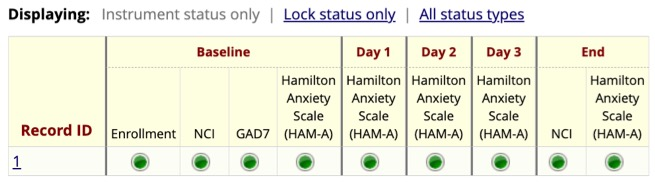

```{r, include = FALSE}
knitr::opts_chunk$set(
  collapse = TRUE,
  comment = "#>"
)
```

```{r setup}
library(tidyREDCap)
```

```{css, echo=FALSE}
p.caption {
  text-align: left;
  color: gray;
  font-style: italic;
}
```

# The Problem

Suppose you have a REDCap project with many instruments; some
instruments are administered in some visits but not in others. In that
case, the export from REDCap will have empty cells for the visits in
which the instrument was not used. For example, Figure 1 shows a study
where subjects completed four instruments (Enrollment, NCI, GAD7, and
Hamilton) at baseline. On days 1, 2, and 3, they completed only
Hamilton. At the end of the study, they completed NCI and Hamilton. The
export of the data for this subject will have five records (one for each
visit), and each record will have a cell for every existing instrument.
However, the “NCI” record will only have values for the baseline and
final visit and empty cells for the visits in between. On the other
hand, there will be no empty spaces for the “Hamilton” record as it was
completed in all the visits. It would be good to have a function that
will export all the data from a project and produce one R table for each
instrument. Those tables should remove the blank records.\
\


<p class="caption" id="fig1">

Figure 1

</p>

The same functionality should help deal with instruments that are
potentially given repeatedly. Common examples include asking
participants to fill out a form describing medical conditions for all
their siblings or asking them to fill out a form for each side effect
they experience while using a drug. In these cases, each participant may
have zero or many records. Again, creating a table with all the records
for these “repeated” instruments would be good.\
\

# The Solution

```{r eval=FALSE}
# Do not type your API token directly into your code
tidyREDCap::import_instruments(
  url = "https://bbmc.ouhsc.edu/redcap/api/",
  token = "9A81268476645C4E5F03428B8AC3AA7B" # This is BAD!
)

# A better way to do this is to read the API key from the .Renviron file
#   For instructions on saving your API key, see link below
tidyREDCap::import_instruments(
  url = "https://bbmc.ouhsc.edu/redcap/api/", 
  token = Sys.getenv("redcap_token")  # This is BETTER!
)

# Another great way to do this is to read the API key from keyring package
#   Save your API key via keyring::key_set("redcap_token")
tidyREDCap::import_instruments(
  url = "https://bbmc.ouhsc.edu/redcap/api/", 
  token = keyring::key_get("redcap_token") # This is GREAT!
)
```

See the [Importing from REDCap](../doc/useAPI.html) vignette for
details/information for saving your API key in the .Renviron file.

The `import_instruments()` function can be given a URL and token for a
REDCap project, like the one created above and it will return one table
for each instrument in a project. By default, the function will drop all
empty records and apply variable labels to the columns. For example, the
above API call is pulling data from a REDCap project that has four
instruments: Enrollment, the Nacho Craving Index (NCI), the Generalized
Anxiety Disorder Assessment (GAD7), and the Hamilton Anxiety Scale
(HAM-A).

After running the above code we get four tables from the REDCap project.


Notice that each repeat of the HAM-A is its own record.


If a person has only done the baseline assessment they will only have
one record.

## Controlling Variable Labels

By default, `import_instruments()` applies descriptive variable labels
to columns based on the field labels from your REDCap project. However,
you can disable this behavior if they labels interfere with other
functions or you prefer to work with unlabeled data:

```{r eval=FALSE}
# Import instruments without variable labels
tidyREDCap::import_instruments(
  url = "https://bbmc.ouhsc.edu/redcap/api/", 
  token = Sys.getenv("redcap_token"),
  labels = FALSE
)
```

This can be useful when labels interfere with other functions or you
prefer working with unlabeled data frames.

## Working with Lists Instead of Environment Tables

By default, `import_instruments()` creates separate tables in your
global environment for each instrument. However, you can instead return
all instruments as a named list using the `return_list = TRUE`
parameter:

```{r eval=FALSE}
# Import instruments as a named list
instruments <- tidyREDCap::import_instruments(
  url = "https://bbmc.ouhsc.edu/redcap/api/", 
  token = Sys.getenv("redcap_token"),
  return_list = TRUE
)

# Access individual instruments from the list
demographics <- instruments$demographics
health <- instruments$health
race_and_ethnicity <- instruments$race_and_ethnicity

# Or work with all instruments
purrr::walk(instruments, ~cli::cli_inform("Instrument has {nrow(.x)} records"))
#> Instrument has 5 records
#> Instrument has 5 records
#> Instrument has 5 records
```

Using `return_list = TRUE` is beneficial when you: - Want to keep
instruments organized in a single object - Need to programmatically work
with multiple instruments - Are building functions that process REDCap
data - Want to avoid cluttering your global environment

## Memory Management for Large Projects

The `import_instruments()` function includes built-in memory management
features to help with large REDCap projects. When you import a large
project, you'll see informative messages about the project size:

-   **Large projects** (25+ million data elements): You'll get
    suggestions to use filtering
-   **Very large projects** (100+ million data elements): You'll get
    warnings about potential memory issues

The function uses an efficient in-memory database
([DuckDB](https://duckdb.org)) to process your data, which helps manage
memory usage. However, for very large projects, you may want to use the
filtering capabilities described in the next section.

## Filtering Large Projects

For large projects or when you only need a subset of your data, you can
use the `filter_function` and `filter_instrument` parameters to reduce
memory usage and improve performance.

### Filter All Instruments Based on One Instrument

Use `filter_instrument` and `filter_function` together to filter all
instruments based on criteria from a specific instrument (e.g.,
demographics):

```{r eval=FALSE}
# Import only participants 18 years or older based on demographics instrument
instruments <- tidyREDCap::import_instruments(
  url = "https://bbmc.ouhsc.edu/redcap/api/", 
  token = Sys.getenv("redcap_token"),
  filter_instrument = "demographics",
  filter_function = function(x) x |> dplyr::filter(age >= 18)
)
```

This approach: 1. First applies the filter to the `demographics`
instrument 2. Gets the `record_id` values from the filtered demographics
data 3. Uses those record IDs to filter ALL other instruments 4. Only
imports records that meet your criteria

### Filter Each Instrument Individually

If you don't specify `filter_instrument`, the `filter_function` will be
applied to each instrument separately:

```{r eval=FALSE}
# Apply the same filter to each instrument individually
instruments <- tidyREDCap::import_instruments(
  url = "https://bbmc.ouhsc.edu/redcap/api/", 
  token = Sys.getenv("redcap_token"),
  filter_function = \(x) x |> filter(record_id == 3)
)
```

### Benefits of Filtering

Filtering is especially useful for: - **Large projects**: Reducing
memory usage and import time - **Longitudinal studies**: Importing only
specific timepoints or visits - **Multi-site studies**: Importing data
from specific sites - **Quality control**: Excluding incomplete or
problematic records

The filtering happens at the database level before data is loaded into R
memory, making it very efficient even for large datasets.
