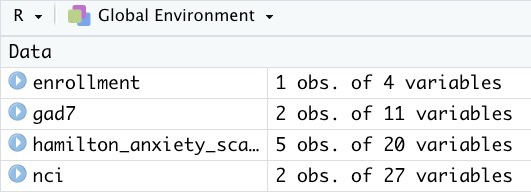

```{r, include = FALSE}
knitr::opts_chunk$set(
  collapse = TRUE,
  comment = "#>"
)
```

```{r setup}
library(tidyREDCap)
```

```{css, echo=FALSE}
p.caption {
  text-align: left;
  color: gray;
  font-style: italic;
}
```


# The Problem 
Suppose you have a REDCap project with many instruments; some instruments are administered in some visits but not in others. In that case, the export from REDCap will have empty cells for the visits in which the instrument was not used. For example, Figure 1 shows a study where subjects completed four instruments (Enrollment, NCI, GAD7, and Hamilton) at baseline. On days 1, 2, and 3, they completed only Hamilton. At the end of the study, they completed NCI and Hamilton. The export of the data for this subject will have five records (one for each visit), and each record will have a cell for every existing instrument. However,  the “NCI” record will only have values for the baseline and final visit and empty cells for the visits in between. On the other hand, there will be no empty spaces for the “Hamilton” record as it was completed in all the visits. It would be good to have a function that will export all the data from a project and produce one R table for each instrument. Those tables should remove the blank records. 
\
\

<p class=caption id="fig1">
Figure 1 </p>
The same functionality should help deal with instruments that are potentially given repeatedly. Common examples include asking participants to fill out a form describing medical conditions for all their siblings or asking them to fill out a form for each side effect they experience while using a drug. In these cases, each participant may have zero or many records. Again, creating a table with all the records for these “repeated” instruments would be good.
\
\

# The Solution

```{r eval=FALSE}
# Do not type your API token directly into your code
tidyREDCap::import_instruments(
  url = "https://redcap.miami.edu/api/",
  token = "1A2B3CXXYYZZOOMMGOSHNOOOOX1Y2Z3" # This is BAD!
)

# The right way to do this is
tidyREDCap::import_instruments(
  url = "https://redcap.miami.edu/api/", 
  token = Sys.getenv("nacho_anxiety_key")
)
```

See the [Importing from REDCap](../doc/useAPI.html) vignette for details/information.

The `import_instruments()` function can be given a URL and token for a REDCap project, like the one created above and it will return one table for each instrument in a project.  By default, the function will drop all empty records. For example, the above API call is pulling data from a REDCap project that has four instruments: Enrollment, the Nacho Craving Index (NCI), the Generalized Anxiety Disorder Assessment (GAD7), and the Hamilton Anxiety Scale (HAM-A).

After running the above code we get four tables from the REDCap project.



Notice that each repeat of the HAM-A is its own record.


If a person has only done the baseline assessment they will only have one record.
