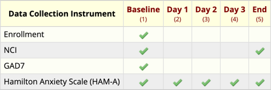

```{r, include = FALSE}
knitr::opts_chunk$set(
  collapse = TRUE,
  comment = "#>"
)
```

```{r setup, message=FALSE}
library(tidyREDCap)
library(dplyr)
```

</br>


# The Problem 

REDCap exports longitudinal projects with one record (a line of data) per assessment (typically 1 line per day).  This works well when every instrument/questionnaire is given at every assessment. Still, for projects with different instruments/questionnaires given on different days, REDCap exports empty values (represented by the value `NA` in R).

> **Example:** In the Nachos for Anxiety project, three instruments were used; they each had a different administration schedule. Subjects' anxiety was assessed at baseline with the Generalized Anxiety Disorder 7-item (GAD-7) scale. Every day, it was assessed with the Hamilton Anxiety Scale (HAM-A), but the Nacho Craving Index was administered only at the baseline and at the end of the study (see the figure below for clarification).  
{alt="Nacho Craving Index administration schedule"}

The instruments that are not assessed every day appear as entirely blank questionnaires when the data is exported.  For example, values from the NCI instrument are shown as missing for Day 1, Day 2, and Day 3 (because it was not administered during those visits). 

In R, this data is displayed as
```{r}
redcap <- readRDS(file = "./redcap_nacho_anxiety.rds")

redcap %>% 
  select(
    # Select these two columns
    record_id, redcap_event_name,
    # And also select all columns between "nachos" and "nci_complete"
    nachos:nci_complete
  ) %>% 
  # Make the table pretty
  knitr::kable()
```

It is often helpful to make a different data table that has the values for each questionnaire without the blank records. 

## Aside: Loading REDCap Data into R
See the [Import All Instruments from a REDCap Project](./import_instruments.html) and [Importing from REDCap](./useAPI.html) vignettes for details/information.


# The Solution

Pass the `make_instrument()` function to the name of a dataset and the names of the first and last variables in an instrument, and it will return a table that has the non-empty records for the instrument.  For example, to extract the enrollment/consent instrument:

```{r}
make_instrument(redcap, "concented", "enrollment_complete") %>% 
  knitr::kable()
```

To extract nacho craving information:

```{r}
make_instrument(redcap, "nachos", "nci_complete") %>% 
  knitr::kable()
```

To make an analysis dataset containing the NCI values **without** the subject ID and the event name:

```{r}
make_instrument(
  redcap,
  "nachos", "nci_complete",
  drop_which_when = TRUE
) %>% 
  knitr::kable()
```

