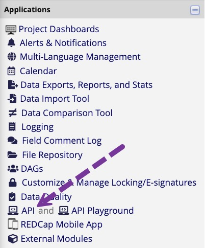

```{r, include = FALSE}
knitr::opts_chunk$set(
  collapse = TRUE,
  comment = "#>"
)
```

```{r setup}
library(tidyREDCap)
```

# Loading REDCap Data into R with an API request
While most people use the "Data Exports, Reports and Stats" Application built into REDCap, another handy method to get data out of REDCap is an API request. An API allows one program to request data from another program.  For example, an add-on package in R can request data from your instance of REDCap.  Obviously, an R package can not *type* your user name and password.  Instead, you will store an API token, a password, on your machine and then ask R to look up that token and pass it to REDCap whenever you want data.

We have used two R packages to access our REDCap projects,`redcapAPI` and `REDCapR`.  Unfortunately, `redcapAPI` is no longer being actively developed, and we have run into problems with it.  It had the lovely benefit of exporting variables, basically using the same variable names as you see in REDCap, then tagging the variables with the "labels" subjects viewed when completing the forms.

We have taken the labeling functionality and added it in tidyREDCap.

### Getting an API Token

If your REDCap project has API access enabled, you will see it in the applications on the left side of the screen. 

{alt="How to obtain an API key from the REDCap dashboard"}

If you don't see that option, talk to your project leader or the REDCap system administrator.

When you click the link you will be given the option to create an API Token for this project. 

Once you have that token created, you can copy and paste it somewhere safe.

### Protecting Your API Tokens

Leaders in the REDCap community have developed techniques for safely storing your REDCap API keys. Ask your REDCap systems administrators how they prefer you store  API keys on your "local machine".

#### NEVER DO THIS!

The functions that allow you to export data need you to give them your API token. Remember, this is the same information as your username and password.  **NEVER** type that directly in your code. That is if your REDCap API key is "1A2B3CXXYYZZOOMMGOSHNOOOOX1Y2Z3" do NOT do this:

```r
# Do not type your API token directly into your code
tidyREDCap::import_instruments(
  "https://redcap.miami.edu/api/",
  "1A2B3CXXYYZZOOMMGOSHNOOOOX1Y2Z3" # This is BAD!
)
```

If you do this, anybody who gets a copy of your code will be able to access your REDCap project.  Also, whenever your run this line of code, the API token will be saved into your R history files.

#### Better Options

You can save your API keys into your operating system's built-in password manager (i.e., macOS Keychain, Windows Credential Manager, or the Secret Service API (GNOME Keyring/KWallet) on Linux). There are several packages available to do this. We recommend using either [`keyring`](https://keyring.r-lib.org/) or [`shelter`](https://cran.r-project.org/web/packages/shelter/index.html). `shelter` is a [solid choice](https://github.com/vubiostat/shelter?tab=readme-ov-file#differences-from-keyring) for users working with multiple operating systems. If you primarily work with one operating system, we recommend using `keyring`.

```r
install.packages("pak")
pak::pak("keyring")
```

To save your key, use code like this:

```r
keyring::key_set("nacho_anxiety_key")
```

A box will appear where you can enter your key. After doing that, you can access the key like this:

```r
tidyREDCap::import_instruments(
  url = "https://redcap.miami.edu/api/", 
  token = keyring::key_get("nacho_anxiety_key")
)
```

In the future, your operating system may ask you to enter your computer's password to access the key.

If you want to use the redcapAPI or the REDCapR packages directly you can use the same trickery to pass your API key to their functions. For example:

```r
rcon <- redcapAPI::redcapConnection(
  url = 'https://redcap.miami.edu/api/', 
  token = keyring::key_get("nacho_anxiety_key")
)

redcap <- redcapAPI::exportRecords(rcon)
```

If you are curious, when we made these help files, we saved the data using the `saveRDS()` function. 

```{r getData, eval=FALSE}
rcon <- redcapAPI::redcapConnection(
  url = 'https://redcap.miami.edu/api/', 
  token = keyring::key_get("nacho_anxiety_key")
)

redcap <- redcapAPI::exportRecords(rcon)

saveRDS(redcap, file = "redcap.rds")
```
