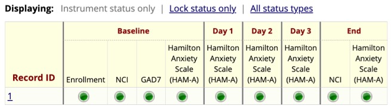
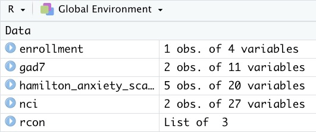
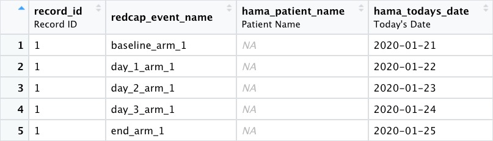

```{r, include = FALSE}
knitr::opts_chunk$set(
  collapse = TRUE,
  comment = "#>"
)
```

```{r setup}
library(tidyREDCap)
```


# The Problem 
If you have a REDCap project that has many instruments, some which are only used on an occasional visit the export from REDCap will be full of empty observations (because the instrument was not used on that visit).  It would be good to have a function that will export all the data from a project and produce one R table for each instrument. Those tables should remove the blank records. 

The same functionality should help deal with instruments that are potentially given repeatedly. Common examples include asking participants to fill out a form describing medical conditions for all their siblings or asking them to fill out a form for each side effect they experience while using a drug.  In these cases each participant may have zero or many records. Again, it would be good to have a table created that has all the records for these "repeated" instruments.


# The Solution

The `import_instruments()` function can be given the name of a redcapAPI connection, like the one created above and it will return one table for each instrument in a project.  By default the function will drop all records. For example the above api call is pulling data from a REDCap project that has four instruments: Enrollment, the Nacho Craving Index (NCI), the Generalized Anxiety Disorder Assessment (GAD7) and the Hamilton Anxiety Scale (HAM-A).



```{r eval=FALSE}
import_instruments(rcon)
```

After running the above code I have four tables from the REDCap project.



Notice that each repeat of teh HAM-A is its own record.



If a person has only done the baseline assessment they will only have record.
